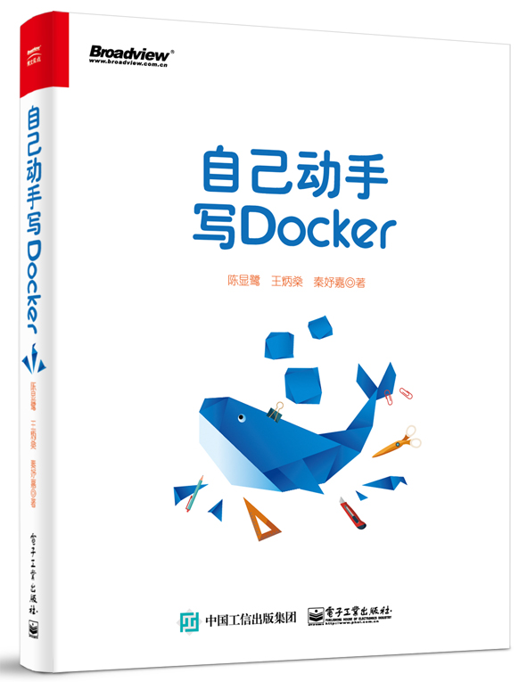

# 自己动手写docker
  本书在详细分析 Docker 所依赖的技术栈的基础上,一步一步地通过代码实例,让读者可以自己循 序渐进地用 Go 语言构建出一个容器的引擎。不同于其他 Docker 原理介绍或代码剖析的书籍,本书旨 在提供给读者一条动手路线,一步一步地实现 Docker 的隔离性,构建 Docker 的镜像、容器的生命周 期及 Docker 的网络等。本书涉及的代码都托管在 GitHub 上,读者可以对照书中的步骤从代码层面学 习构建流程,从而精通整个容器技术栈。本书也对目前业界容器技术的方向和实现做了简单介绍,以 加深读者对容器生态的认识和理解。   
  
  本书适合对容器技术已经使用过或有一些了解,希望更深层次掌握容器技术原理和最佳实践的读者。
  
# 购买链接
天猫[自己动手写docker](https://detail.tmall.com/item.htm?spm=a230r.1.14.27.L5ZqXQ&id=553996951094&ns=1&abbucket=15)

京东[自己动手写docker](https://item.jd.com/12109237.html)

## 目录
- 前言
	
- 第一章 容器与开发语言
	- Docker
	- Golang

- 第二章 基础技术
	- Linux Namespace
  		- 概念
  		- UTS Namespace
  		- IPC Namespace
  		- PID Namespace
  		- Mount Namespace
  		- User Namespace
  		- Network Namespace		  
	- Linux Cgroups
  		- 什么是Linux Cgroups
  		- Docker是如何使用Cgroups的
  		- 用go语言实现通过cgroup限制容器的资源

  	- Union File System
  		- 什么是Union File System
  		- Docker是如何使用Union File System的
  		- 自己动手写Union File System 例子

- 第三章  构造容器
	-  构造实现run命令版本的容器
		- Linux proc 文件系统介绍
		- 实现 run 命令
	- 使用Cgroups 限制容器资源使用
		- 定义Cgroups的数据结构
		- 在启动容器的时候增加资源限制的配置 
	- 增加管道以及环境变量识别
		- 管道
		- PATH识别	
		
- 第四章 构造镜像 
	- 使用busybox创建容器
		- busybox
		- pivot_root
	- 使用 AUFS 包装busybox
	- 实现volume数据卷
	- 实现简单镜像打包
	
- 第五章 构建容器进阶
	- 实现容器的后台运行 
	- 实现查看运行中容器
	- 实现查看容器日志
	- 实现进入容器Namespace
	- 实现停止容器
	- 实现删除容器
	- 实现通过容器制作镜像
	- 实现容器指定环境变量运行

- 第六章 容器网络
	- 容器虚拟化网络基础技术介绍
	- 构建容器网络模型
	- 容器地址分配
	- 创建Bridge网络
 	- 在Bridge网络创建容器
 	- 容器跨主机网络

- 第七章 高级实践	
	- 使用mydocker创建一个可访问nginx容器
	- 使用mydocker 创建一个flask + redis的计数器
	- runC介绍
	- runC创建容器流程
	- containerd介绍
	- kunernets CRI 容器引擎
 	
## 作者列表
- 陈显鹭 (阿里云容器服务团队)
- 王炳燊 (阿里云容器服务团队)
- 秦妤嘉 (阿里云容器服务团队)
